# Smoothie Selector

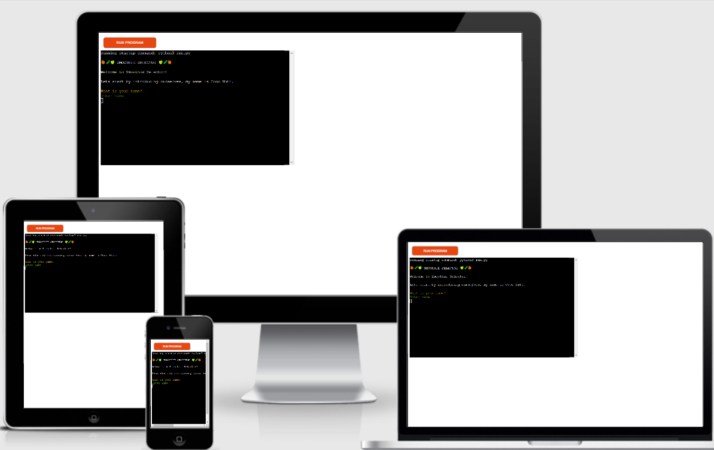

## Table of contents
1. [Introduction](#introduction)
2. [UX](#ux)
    * [Site owner goals](#site-owner-goals)
    * [User needs](#user-needs)
3. [Features](#features)
    * [Existing features](#existing-features)
    * [Features left to implement](#features-left-to-implement)
4. [Testing](#testing)
    * [User needs](#user-needs)
    * [Challenges](#challenges)
    * [Validator testing](#validator-testing)
    * [Unfixed bugs](#unfixed-bugs)
5. [Deployment](#deployment)
6. [Credits](#credits)
    * [Content](#content)
    * [Acknowledgements](#acknowledgements)

## Introduction 

Smoothie Selector is an interactive command line program which aims to help users decide on which smoothie to make. It is targeting users who are interested in making smoothies based on their nutritional value. The program iterates through a series of questions in order to narrow the smoothie choice selection down for the user based on their responses. 

## UX

### Site owner goals

The objectives of the site owner are: 
1. To create a user friendly, attractive, command line program that is easier to follow.
2. To create a program that is useful for target users.
3. To create a program to that is of industry standard.

### User needs

User would like:

1. To be able to open up the program and immediately be able to grasp what its purpose is.
2. A program that is appealing and easy to follow through.
3. A program that asks relevant questions and eventually identifies a smoothie recipe that meets their preferences.
4. The program to display all the necessary details of a smoothie recipe such as the ingrediants, method and nutritional data.

## Features

### Existing features

1. Structure and formatting
* The main body of text is in white font and only key pieces of text have been styled in a different colour to highlight their importance. 

* The program structure is based on the below flow diagram.

Structure of program:

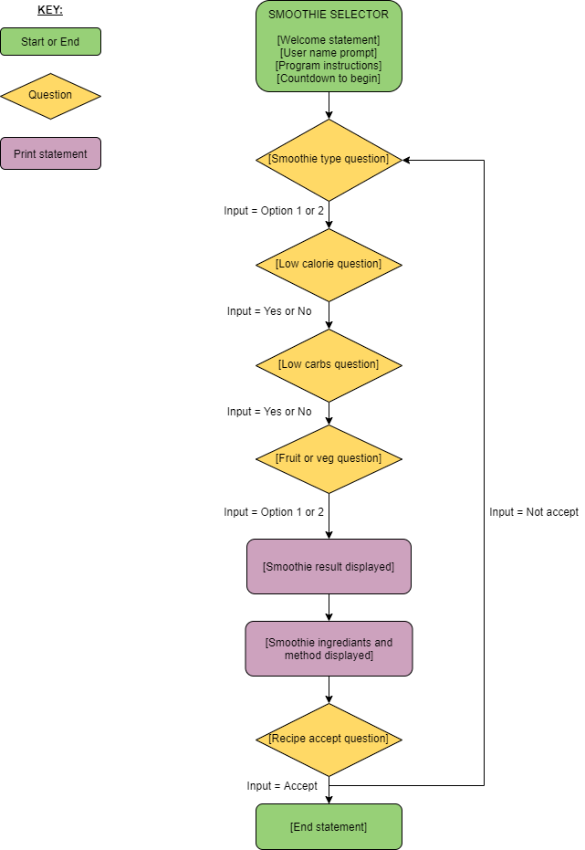

2. Title and welcome
* The title is enclosed between three fruit or veg emoji's either side of it and it is uppercase. 
* The purpose of this is to make it stand out from the rest of the text, to emphasize its purpose through the emojis and make the program look appealing. 
* The welcoming statement prompts the user for a name to personalise the interaction between the program and the user.

2. Countdown timer
* A countdown timer of ten seconds is added after the program instructions are displayed.
* This is to allow the user to prepare for the events that follow and also add a fun feature to the application.

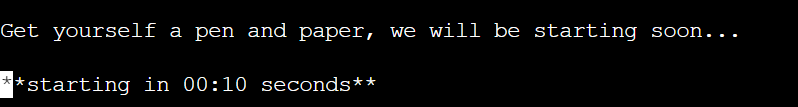

3. Question and input prompts
* The question and input prompts have been styled with colour, consistently throughout the program. 
* The questions are in yellow. 
* The input prompts are in green.
* This is to help users to distinguish the question and input prompts from the rest of the text.

4. Invalid entries
*  Any invalid input entries are displayed in red and bold font to highlight the error to the user.
* The error message displays what the error is as well as what entry the user should be making so that users can easily identify their error and know how to rectify them.
* The input prompt re-appears so that users can re-enter a valid entry. 

5. Result
* After the user finishes answering the smoothie decision questions, a smoothie is revealed to them, based on their choices.
* The smoothie recipe name is in red, bold colour and highlighted on a yellow background. This is to emphasize that the end goal of the program has been reached. 

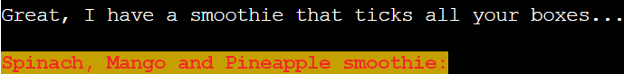

### Features left to implement

If I had further time on this project I would like to add additional questions about nutritional data such as protein levels and perhaps what fruit items the user would like to use to filter down their options further. 

I would also like to add other types of smoothies for example, indulgent smoothies or quick smoothies.

## Testing

### User needs

Here I will identify a user need and run through how this is being met by the program.

1. To be able to open up the program and immediately be able to grasp what its purpose is.
* When the application is opened up the program purpose is explained in brief so users can easily grasp what the program is about.

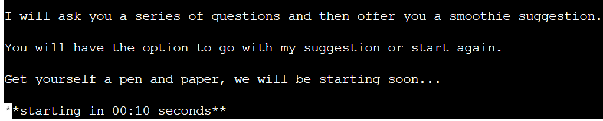

2. The program is appealing and easy to follow.
* The colours used throughout this program are; red, green, yellow and white. This is to make the program look appealing and also help distinguish certain pieces of text.
* The questions and inputs are styled in colour and the rest of the text in white (with the exception of the recipe name), this is so that users can develop a familiarity with what type of text is being displayed and whether they need to provide an input. 
* Between each key statement there is a time delay before the next statement is printed and there is space between statements. This helps the user to digest the events that are happening. 
* The text is informal, focussed and is designed to flow systematically to make it easy for the user to follow through.
 
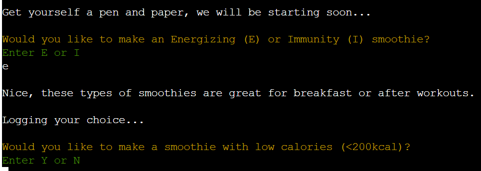

3. The program asks relevant questions and eventually identifies a smoothie recipe that meets user preferences.
* I have conducted internet research to have a look at the types of smoothie recipes that are available and how they are marketed and from this I have chosen specific questions that I believe maybe relevant for a user.
* There are four questions that are asked in succession to help whittle down the smoothie selection to one smoothie for the user. This has been checked and all possible input choices lead to one smoothie recipe. 

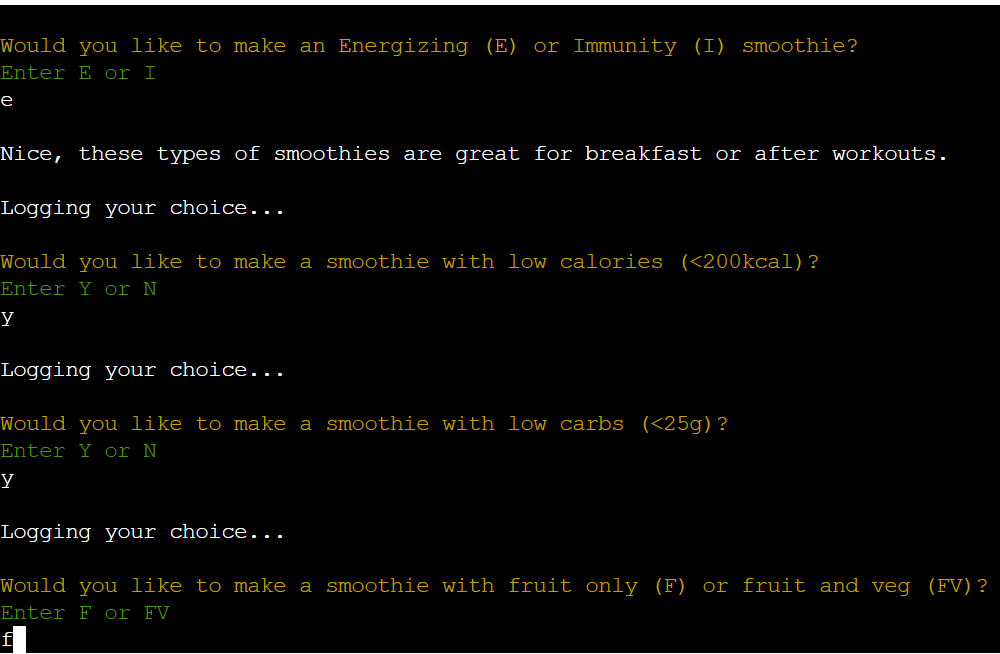

4. The program to display all the necessary details of a smoothie recipe such as the ingrediants, method and nutritional data. 
* All the recipe details that are conventionally present in a recipe are displayed to the user; the recipe serving size, ingrediants, method and key nutritional data. 
* A summary of the user input entries for all smoothie decision questions are stated below the smoothie recipe name as a reminder of their responses, so they do not have to scroll up through the questions to find their responses. 

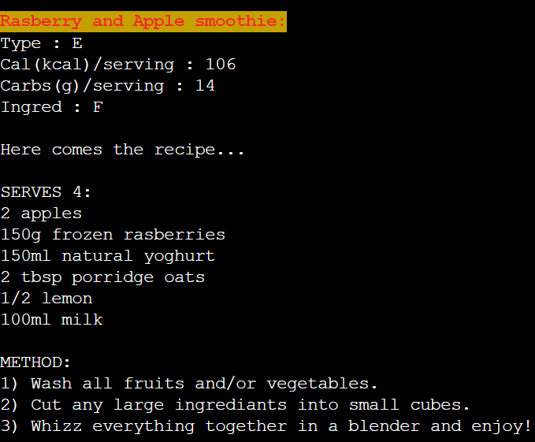

### Challenges

1. Code structure

Initially, my code was structured such that each function was being called from within the previous function, so that they all linked together. However, after consultation with my mentor and also using the [Code Institute](https://codeinstitute.net/5-day-coding-challenge/?utm_term=code%20institute&utm_campaign=a%26c_SEA_UK_BR_Brand_Code_Institute&utm_source=adwords&utm_medium=ppc&hsa_acc=8983321581&hsa_cam=1578649861&hsa_grp=62188641240&hsa_ad=492338271836&hsa_src=g&hsa_tgt=kwd-319867646331&hsa_kw=code%20institute&hsa_mt=e&hsa_net=adwords&hsa_ver=3&gclid=EAIaIQobChMI9OSlzraT8wIVgbTtCh0lSQINEAAYASAAEgJHFvD_BwE) Love Sandwiches walk-through project as a guideline, I realised that this was not the best practice and it would be better to have one function (referred to as the main function in my code) from which all others could be called. For this reason, I re-worked all of my code. 

2. Print statements of function output

Initially, after each function I was printing out the outcome of the function to the console. This, however, made the console appear cluttered and did not seem like it would create the best UX. For this reason, I re-worked my code at the same time as I created the main function to call all my functions from, so that each function was returning the outcome which was then inherited by the next function. 

3. Smoothie variable

After re-working my code so functions were being called from one function (main function), the next challenge I faced was how I was able to iterate through the smoothie dictionary so that the items of the dictionary could be be filtered down after each question. I initially assigned the smoothie variable to equal the smoothies dictionary and used the pop method after each function for loop to filter out items.However, what this meant was that at the end of the code if a user wanted to re-start the program again (if they were not happy with the smoothie suggestion), if would only recognize one item as being a part of the dictionary. For this reason, I decided to assign the smoothie variable to a copy of the smoothies dictionary using the copy method so that if the program had to be re-run the original dictionary would be copied in full. 

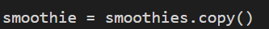

4. Error handling code

Initially, my code repeated the same error handling code block with slight wording changes after each question function. However, I felt that this could be refractored so that one error handling block could be called from within multiple functions, which would reduce repetition. After taking inspiration from the [Code Institute](https://codeinstitute.net/5-day-coding-challenge/?utm_term=code%20institute&utm_campaign=a%26c_SEA_UK_BR_Brand_Code_Institute&utm_source=adwords&utm_medium=ppc&hsa_acc=8983321581&hsa_cam=1578649861&hsa_grp=62188641240&hsa_ad=492338271836&hsa_src=g&hsa_tgt=kwd-319867646331&hsa_kw=code%20institute&hsa_mt=e&hsa_net=adwords&hsa_ver=3&gclid=EAIaIQobChMI9OSlzraT8wIVgbTtCh0lSQINEAAYASAAEgJHFvD_BwE) Love Sandwiches project, I reworked my code and created a validate data function which called for three parameters; the input value and the two choice answers. The validate data function could then be called from multiple functions using different input value arguments. Thus allowing the error message to appear slightly differently when called by different functions. 

I used python tutor extensively throughout this project to first test out any new code I wish to implement in my project, see below an example of how I used python tutor to test the validate data function. 

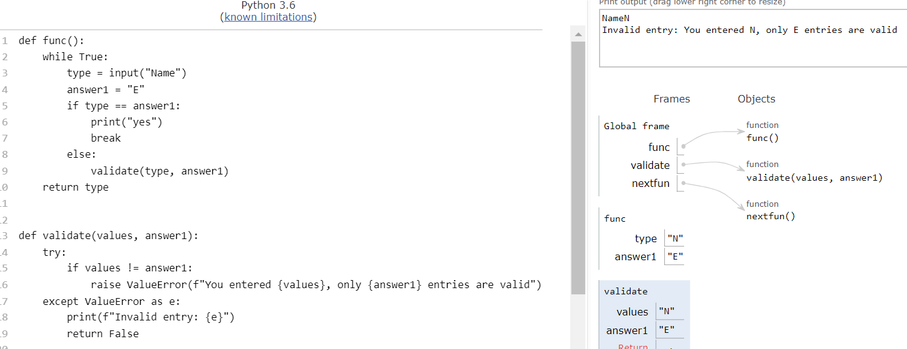

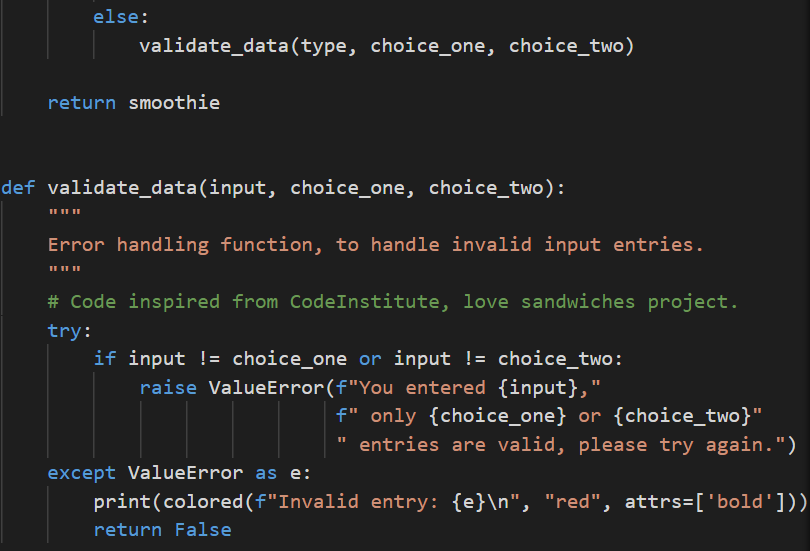

5. Print ingrediants in a vertical list

I wanted to be able to print the ingrediants of a recipe in vertical list, as is the convention, however as the ingrediants in my code were in a nested list within a dictionary, they were printing out in a row. I found from the [codegrepper](https://www.codegrepper.com/code-examples/python/how+to+print+list+vertically+in+python) website a coding solution to be able to print out lists in a vertical fashion, so that each ingrediant could be printed on a new line. I applied this logic to my nested lists code. 

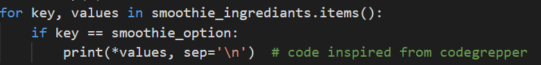

### Validator testing

In this project, the errors that I mostly came across were the following:

1. Pep8 E501 - line too long:
* This error was rectified either by using either a backslash or quotation marks to split a long piece of text into two and separating them onto two lines. 

2. Flake8 W291 - trailing white space:
* This error was rectified by removing any white space, which was initially difficult to notice, but usually occured when rectifying the Pep8 E501 error.
* After part of a long piece of text was moved onto the next line, this left an a trailing white space at the end of the original line. 

3. Flake8 E117 and E121 - over/under-indented:
* This indentation error frequently occured whilst resolving the Pep8 E501 error.
* The new line was not indented inline with where the original text had begun. 

4. Flake8 E302 - expected 2 lines, found 1:
* This problem occured when creating functions, as I often left only one line between functions. 

After rectifying all errors Pep8 online validator was used to check the code in the run file and the recipes file, both passed the validator check. 

Recipe file:

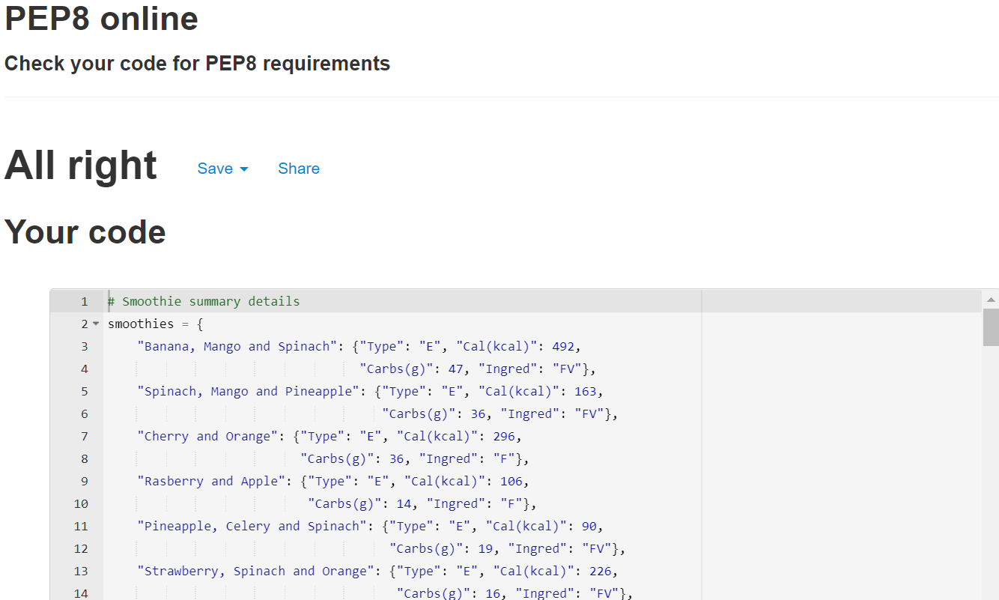

Run file:

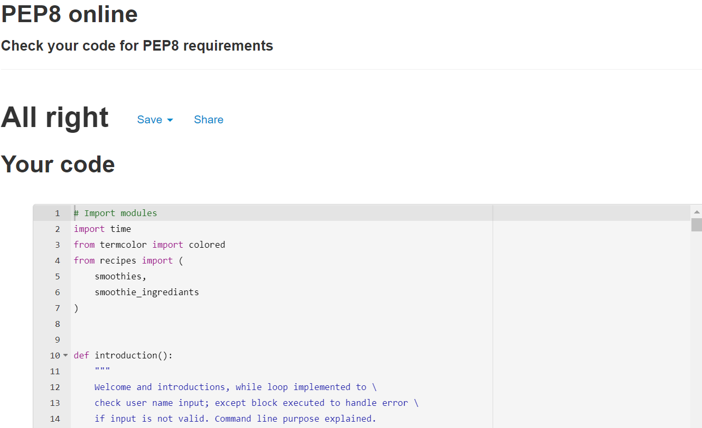

### Unfixed bugs 
* There are no unfixed bugs in this project that I am aware of.

## Deployment

This program was deployed to Heroku, following the below steps:

1) Push most up-to-date code to Github

2) Create a list of requirements by typing the following into the terminal:
pip3 freeze > requirements.txt

3) Push the requirements to Github

4) Logon to Heroku

5) Select create new app 

6) Add app name 

7) Add app region

8) Select 'Create app'

9) Open up the Settings tab, on the top ribbon

10) In 'Config Vars' select 'Reveal Config Vars'

11) Add 'PORT' as a key and '8000' as a value

12) In 'Buildpacks' select 'Add buildpack' and choose python. Then, repeat for nodejs (order is important; python first followed by nodejs) 

13) Navigate to 'Deploy' on the top ribbon

14) In 'Deployment method', select 'Github', once clicked it should say 'connected'

15) Enter a repository in Github to connect to and click 'Search'

16) Once repository has been found, click 'Connect' to link new app to Github repository

17) In 'Automatic deploys', select the 'Enable Automatic Deploy' option

18) To view your command line on the Heroku platform, once a new code has been pushed to Github, log on to Heroku

19) Select the required app that appears on your home screen

20) Select 'Open app' on the right hand side of the screen 

21) The app should appear in a new tab on the web browser

22) The link to my Heroku app is:
https://smoothie-selector.herokuapp.com/

23) The Github link for this project is:
https://github.com/JPatel87/smoothie-selector

## Credits 

### Content

* Code institute for providing a python essentials template to work from.
* The following recipe websites which were used to obtain all my recipes; [bbc good food](https://www.bbcgoodfood.com/recipes), [downshifology](https://downshiftology.com/), [jar of lemons](https://www.jaroflemons.com/), [clean eating magazine](https://www.cleaneatingmag.com/) and [vitamix](https://www.vitamix.com/us/en_us/).
* To create a flowchart for my project [diagrams.net](https://app.diagrams.net/) was used. 
* The external python library [termcolor](https://pypi.org/project/termcolor/) was used to import colour to text.
* The emojis used in this program were codes taken from the [Unicode Consortium](http://www.unicode.org/emoji/charts/full-emoji-list.html).
* Instructions on how to install and use the python external library termcolor was taken from the youtube channel [Language Programs](https://www.youtube.com/watch?v=tLYHMKeeFIU).
* Instructions on how to add time delays to code were taken from the website [Real Python](https://realpython.com/python-sleep/).
* For general troubleshooting advice, the following websites were used; [Code Institute](https://codeinstitute.net/5-day-coding-challenge/?utm_term=code%20institute&utm_campaign=a%26c_SEA_UK_BR_Brand_Code_Institute&utm_source=adwords&utm_medium=ppc&hsa_acc=8983321581&hsa_cam=1578649861&hsa_grp=62188641240&hsa_ad=492338271836&hsa_src=g&hsa_tgt=kwd-319867646331&hsa_kw=code%20institute&hsa_mt=e&hsa_net=adwords&hsa_ver=3&gclid=EAIaIQobChMI9OSlzraT8wIVgbTtCh0lSQINEAAYASAAEgJHFvD_BwE) Python Essentials module and love sandwiches walk-through project,  [Stack Overflow](https://stackoverflow.com/) and [W3 Schools](https://www.w3schools.com/).

### Acknowledgements

This project has been an eye-opening experience for me to develop a command line program that looks appealing and is able to manipulate data to deliver results. My thanks goes to Code Institute tutor support who have been fantastic at answering all my queries and my tutor, Seun Owonikoko, for her insight and guidance.
