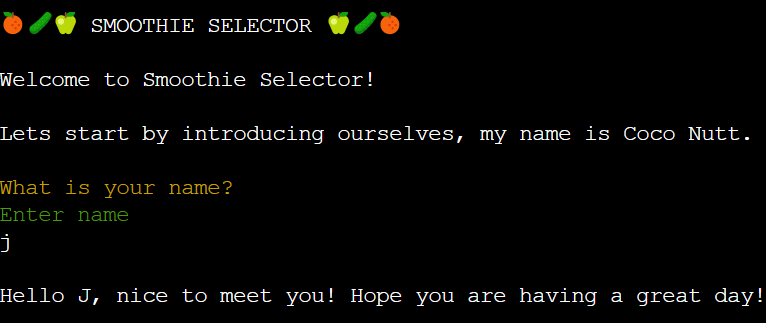
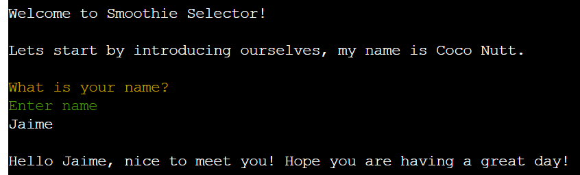
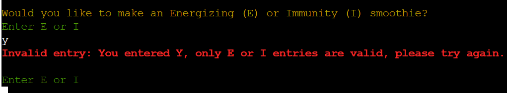

# Smoothie Selector

Smoothie Selector is an interactive command line program which aims to help users decide on which smoothie to make. It is targeting users who are interested in making smoothies based on their nutritional value. The program iterates through a series of questions in order to narrow the smoothie choice selection down for the user based on their responses. 

# UX

## Site Owner Goals

The objectives of the site owner are: 
* To create a user friendly, attractive, command line program that is easier to follow.
* To create a program that is useful for target users.
* To create a program to that is of industry standard.

## User Stories

User would like:

* To be able to open up the program and immediately be able to grasp what its purpose is.
* The program is clean and consistent in layout.
* The program is easier to follow through.
* The program asks relevant questions to help identify a smoothie recipe that meets their needs.

# Features

## Existing Features

### General 
* The colours used throughout this program are; red, green, yellow and white.
* This is to make the program look appealing and also help distinguish certain pieces of text.
* The main body of text is in white font and only key pieces of text have been styled in a different colour to highlight their importance. 
* The text is written in an informal manner, lines of text have been separated with white space, to make the information easier to digest for the user. 
* Between each key statement there is a time gap before the next statement is printed, which also helps the reader to digest the events that are happening. 
* The text displayed to the user is systematic, kept to a minimum and is focussed to make it easy for the user to follow through and keep on topic. 
* The structure of the program is as follows; introduction to program, questions, results, recipe details and end game options. 

### Title and Welcome
* The title is enclosed between three fruit emoji's either side of it and it is uppercase. 
* The purpose of this is to make it stand out from the rest of the text, to emphasize its purpose through the emojis and make the program look appealing. 
* The welcoming statement prompts the user for a name to personalise the interaction between the program and the user.
* The program purpose is explained in brief so users can easily grasp what the program is about. 

### Questions and Inputs
* The question and input prompts have been styled with colour, consistently throughout the program. 
* The questions are in yellow 
* The input prompts are in green
* This is to help users to distinguish the question and input prompts from the rest of the text.

### Invalid entries
*  Any invalid input errors are displayed in red, bold font to highlight the error to the users attention.
* The error message displays what the error is as well as what entry the user should be making so that users can easily identify their error and know how to rectify them.
* The input prompt re-appears so that users can re-enter a valid entry. 

### Result
* The smoothie recipe name is in yellow colour, highlighted on a magenta background.
* This is the only piece of text that is styled this way to signify the end of the smoothie decision questions for the user and highlight the final result. 
* A summary of the users answer for all smoothie decision questions are stated below the smoothie recipe name as a reminder of their responses, so they do not have to scroll up through the questions to find their responses. 
* Calorie and Carbohydrate data are displayed as actual values to provide the user with more valuable nutritional data, rather than just stating e.g low calories and low carbohydrates. 

[NEED TO TAKE SCREENSHOT OF RECIPE AND SUMMARY INFORMATION]

### Recipe
* All the recipe details that the user expects to see are detailed below the recipe name and summary information.
* This includes; recipe serving size, ingrediants and method. 
* The ingrediants are displayed in a vertical list following the structure of a typical ingrediants list that users would be familiar seeing. 
* The serving size and method are both in uppercase to distinguish them from the rest of the text. 

[NEED TO TAKE SCREENSHOT OF RECIPE DETAILS]

# Deployment

This program was deployed to Heroku, following the below steps:

1) Push most up-to-date code to Github

2) Create a list of requirements by typing the following into the terminal:
pip3 freeze > requirements.txt

3) Push the requirements to Github

4) Logon to Heroku

5) Select create new app 

6) Add app name 

7) Add app region

8) Select 'Create app'

9) Open up the Settings tab, on the top ribbon

10) In 'Config Vars' select 'Reveal Config Vars'

11) Add 'PORT' as a key and '8000' as a value

12) In 'Buildpacks' select 'Add buildpack' and choose python. Then, repeat for nodejs (order is important; python first followed by nodejs) 

13) Navigate to 'Deploy' on the top ribbon

14) In 'Deployment method', select 'Github', once clicked it should say 'connected'

15) Enter a repository in Github to connect to and click 'Search'

16) Once repository has been found, click 'Connect' to link new app to Github repository

17) In 'Automatic deploys', select the 'Enable Automatic Deploy' option

18) To view your command line on the Heroku platform, once a new code has been pushed to Github, log on to Heroku

19) Select the required app that appears on your home screen

20) Select 'Open app' on the right hand side of the screen 

21) The app should appear in a new tab on the web browser

22) The link to my Heroku app is:
https://smoothie-selector.herokuapp.com/

23) The Github link for this project is:
https://github.com/JPatel87/smoothie-selector

# Credits 

## Content

* Code institute for providing a python essentials template to work from.
* The following recipe websites which were used to obtain all my recipes; [bbc good food](https://www.bbcgoodfood.com/recipes), [downshifology](https://downshiftology.com/), [jar of lemons](https://www.jaroflemons.com/), [clean eating magazine](https://www.cleaneatingmag.com/) and [vitamix](https://www.vitamix.com/us/en_us/).
* To create a flowchart for my project [diagrams.net](https://app.diagrams.net/) was used. 
* The external python library [termcolor](https://pypi.org/project/termcolor/) was used to import colour to text.
* The emojis used in this program were codes taken from the [Unicode Consortium](http://www.unicode.org/emoji/charts/full-emoji-list.html).
* Instructions on how to install and use the python external library termcolor was taken from the youtube channel [Language Programs](https://www.youtube.com/watch?v=tLYHMKeeFIU).
* Instructions on how to add time delays to code were taken from the website [Real Python](https://realpython.com/python-sleep/).
* For general troubleshooting advice, the following websites were used; [Code Institute](https://codeinstitute.net/5-day-coding-challenge/?utm_term=code%20institute&utm_campaign=a%26c_SEA_UK_BR_Brand_Code_Institute&utm_source=adwords&utm_medium=ppc&hsa_acc=8983321581&hsa_cam=1578649861&hsa_grp=62188641240&hsa_ad=492338271836&hsa_src=g&hsa_tgt=kwd-319867646331&hsa_kw=code%20institute&hsa_mt=e&hsa_net=adwords&hsa_ver=3&gclid=EAIaIQobChMI9OSlzraT8wIVgbTtCh0lSQINEAAYASAAEgJHFvD_BwE) Python Essentials module and love sandwiches walk-through project,  [Stack Overflow](https://stackoverflow.com/) and [W3 Schools](https://www.w3schools.com/).

## Acknowledgements

This project has been an eye-opening experience for me to develop a command line program that looks appealing and is able to manipulate data to deliver results. My thanks goes to Code Institute tutor support who have been fantastic at answering all my queries and my tutor, Seun Owonikoko, for her insight and guidance.
